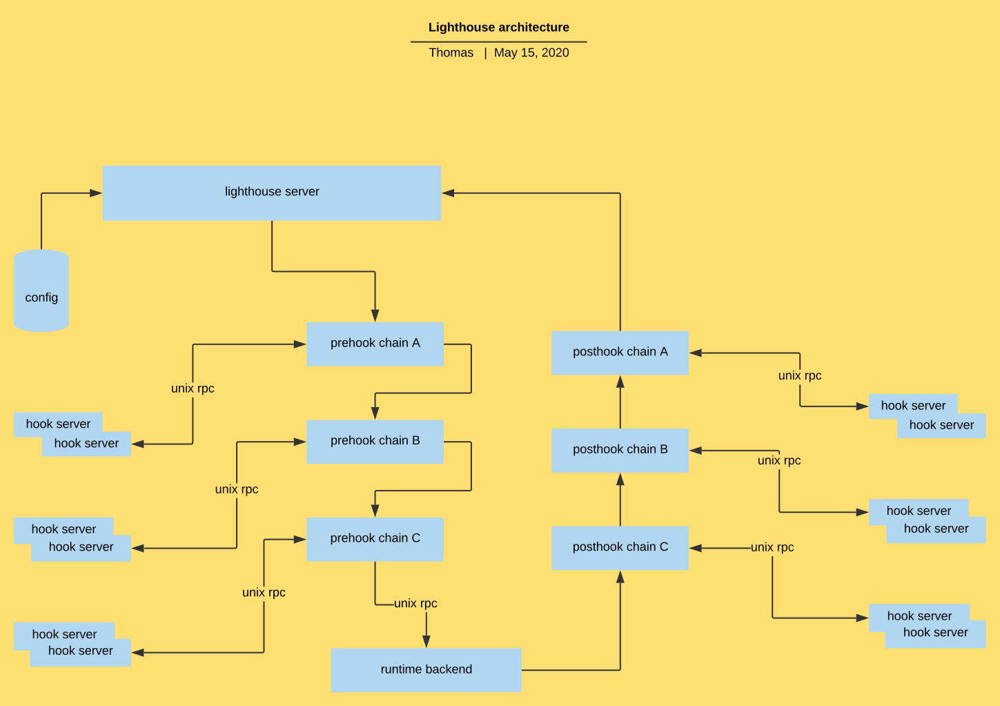

# Summary

Lighthouse is a framework to pre-hook runtime request. With this hook, we can dynamically add options to any other OCI arguments which aren
't supported in Kubernetes.

# Architecture



# Hook Configuration

```
apiVersion: lighthouse.io/v1alpha1
kind: hookConfiguration
timeout: 10
listenAddress: unix:///var/run/lighthouse.sock
webhooks:
- name: lighthouse.io
  endpoint: unix://@lighthouse-hook
  failurePolicy: Fail
  stages:
  - urlPattern: /containers/create
    method: post
```